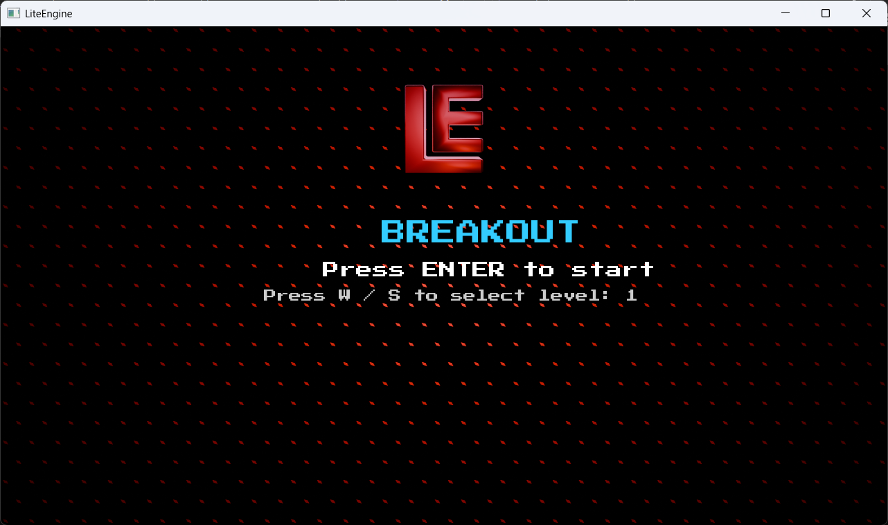

<div align="center">
  

  <h1>LiteEngine</h1>
  <p><em>A custom, data-driven 2D game engine built in C++, optimized for low-latency event routing and high-throughput rendering.</em></p>
</div>

---

## 🎮 Engine Demo: Breakout

To rigorously validate the engine's core subsystems, a fully playable "Breakout" clone is integrated natively within the Sandbox project.



🎥 **[Click here to watch the Gameplay Showcase Video](Sandbox/assets/working_demo/Gameplay_footage.mp4)**
---

## 🏗️ Architecture

LiteEngine is designed with a modular, decoupled architecture, allowing the core engine to handle windowing, input, rendering, and UI — so you can focus purely on game logic.


### Core Subsystems

- **Scalable LayerStack** — Strictly orders game logic and UI updates.
- **Blocking Event Dispatcher** — Intercepts OS inputs (mouse/keyboard) and prevents input bleeding between layers.
- **Abstracted Rendering** — A platform-agnostic Renderer2D API utilizing GLAD and GLM, currently backed by a custom OpenGL implementation.
- **Centralized Resource Management** — Uses hash maps to cache shader and texture pointers, severely cutting down on memory overhead.
- **Developer Tooling** — Native Dear ImGui integration with viewport docking for real-time debugging, alongside spdlog system logging.

---

## 🚀 Performance & Metrics

LiteEngine is architected for low overhead and continuous high-throughput execution. To validate the engine, strict stress testing was performed simulating a massive grid of 750+ active entities.

| Metric | Result | Optimization Technique |
|---|---|---|
| Rendering Throughput | Stable 120 FPS | Custom batch rendering pipeline (DrawQuad batching). |
| Event Propagation | < 1.0 ms latency | Highly optimized LayerStack routing and CPU execution. |
| VRAM Allocation | 99.8% Savings | ResourceManager caches pointers; prevented 787 MB of unnecessary VRAM overhead. |

---

## 📂 Repository Structure

```
LiteEngine/
├── LiteEngine/                  # Core engine (compiled as a static library .lib)
│   ├── src/                     # Engine source files and headers
│   │   └── hzpch.h / hzpch.cpp  # Precompiled header
│   └── vendor/                  # Third-party dependencies
│       ├── GLFW/                # Windowing and input
│       ├── Glad/                # OpenGL function loader
│       ├── imgui/               # Dear ImGui (git submodule)
│       ├── glm/                 # Math library
│       ├── spdlog/              # Logging library (git submodule)
│       └── bin/premake/         # Vendored Premake5 binary
├── Sandbox/                     # Demo application (contains Breakout clone)
├── GenerateProjects.bat         # One-click project generation script (Windows)
└── premake5.lua                 # Premake build configuration
```

---

## 🛠️ Prerequisites

Only **Windows 10/11** is currently supported. Ensure you have the following installed:

- **Visual Studio 2022** (or 2019) with the *Desktop development with C++* workload.
- **Git** (required to clone and initialize submodules).

> **Note:** Premake5 is already vendored in the repository. You do not need to install it separately.

---

## ⚙️ Building the Project

### Step 1 — Clone the repository

You must clone recursively to pull in the git submodules (spdlog and imgui).

```bash
git clone --recursive https://github.com/Tanmay-gsn/LiteEngine.git
cd LiteEngine
```

*(If you already cloned without `--recursive`, run: `git submodule update --init --recursive`)*

### Step 2 — Generate Visual Studio project files

Run the provided batch script from the root of the repository to target Visual Studio 2022:

```dos
GenerateProjects.bat
```

### Step 3 — Compile and Run

1. Open `LiteEngine.sln` in Visual Studio.
2. In the Solution Explorer, right-click the **Sandbox** project and select **Set as Startup Project**.
3. Select your build configuration from the top toolbar (**Debug**, **Release**, or **Dist**).
4. Press **Ctrl+Shift+B** to compile.
5. Press **F5** to launch the engine and play the Breakout demo.

### Build Configurations

| Configuration | Defines | Optimization | Use Case |
|---|---|---|---|
| Debug | `LE_DEBUG` | Off | Development — full symbols, assertions enabled. |
| Release | `LE_RELEASE` | On | Testing — optimized but still debuggable. |
| Dist | `LE_DIST` | On | Distribution — stripped, production-ready build. |

---

## 📦 Dependencies

All dependencies are vendored inside `LiteEngine/vendor/` and are built as part of the solution automatically.

| Library | Source | Purpose |
|---|---|---|
| GLFW | Vendored | Window creation, OpenGL context, input events |
| Glad | Vendored | OpenGL function loader |
| Dear ImGui | Git Submodule | Immediate mode debug/editor UI |
| GLM | Vendored | Math (vectors, matrices, transforms) |
| spdlog | Git Submodule | Fast header-only logging |

---

## ⚠️ Troubleshooting

- **Submodule folders are empty (`imgui` or `spdlog`)** — Run `git submodule update --init --recursive`.
- **`LiteEngine.sln` not found** — The solution file is generated locally. Run `GenerateProjects.bat` first.
- **Build errors about missing headers** — Ensure you are building the entire solution (`Ctrl+Shift+B`), not just a single project. The Core LiteEngine library must compile before Sandbox.
- **LNK4006 linker warnings** — These are expected and harmless, regarding `opengl32.lib` and `dwmapi.lib`. They are suppressed via `/ignore:4006`.
=======
